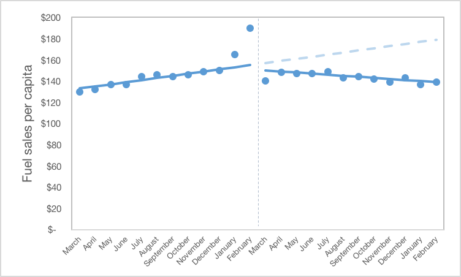

```{r setup, include=FALSE}
knitr::opts_chunk$set(echo = TRUE)
```

For our final marked quiz this week, let us circle back to Sophie's proposed study on carbon taxes for the last time to talk about time periods, analytic cohorts, and outcomes.

## Time Periods
After receiving her data for the single series study, let us assume that Sophie saw the following pattern:



### Question 1

What is most likely going on in the time periods around the intervention?

* A co-intervention

* Data quality issues

* A phase-in period for the intervention

* __Anticipatory effects__

*Explanation*
The pattern of the data shown is almost certainly the result of anticipatory effects. It suggests that the carbon tax was announced in advance and people rushed to the gas station to fill up before it took effect, hence the spike in use in the month before and the decline in the month afterward.

### Question 2

Let us assume that Sophie found out that the carbon tax was repealed in January 2014 and she can't get any more recent data. What should she do with her study?

* Move on and study a different topic

* __Limit her time period to December 2013__

* Model it anyway and be sure to note this in the limitations section of her paper

* Model the repeal of the tax as a separate intervention 

*Explanation*
If Sophie limits her time period to the month before the tax is repealed, this will leave her with a clean data series without this potential co-intervention. Proceeding with modeling (response C) is likely to result in a model that does not fit well due to the likely increase in sales after this second change.

## Analytic Cohorts

### Question 3

If Sophie can get individual-level data, which of the following would be a good cohort to study?

* Low-income individuals

* Vehicle owners

* People who commute to work

* __All of the above__

*Explanation*
One might expect the carbon tax to impact all of the above groups more significantly than the remainder of the population.

## Outcomes of Interest

### Question 4

Sophie has decided to include Bogusland in here analysis and perform an interrupted time series with control to examine the impact of the carbon tax. Which of the following would be appropriate outcomes for her to use?

* __Dollar sales of fuel per capita per month__

* Total litres of fuel sold per month

* Sum of gas station profit losses

* __Percentage of people purchasing gasoline per month__

*Explanation*
Remember that outcomes for an ITS analysis should be comparable between groups. As we have no information on the relative sizes of the two states under study, using any sort of total would be inappropriate. Therefore, reponses B and C are incorrect.