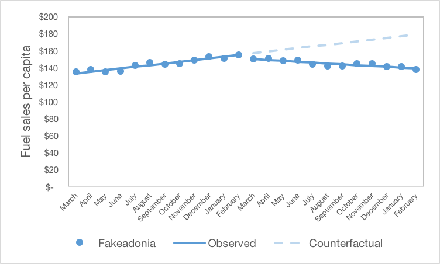
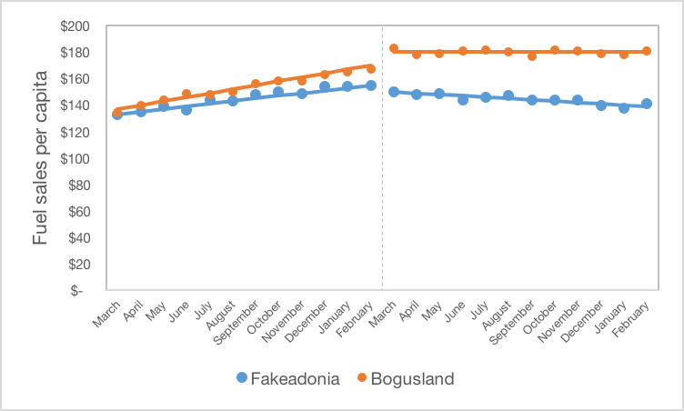

```{r setup, include=FALSE}
knitr::opts_chunk$set(echo = TRUE)
```

For this section’s quiz, we will return to Sophie’s study on the impact of Fakeadonia’s carbon tax on fuel sales. Just to refresh your memory, on March 1, 2013 the small island state introduced a carbon tax of $0.30 per litre. Sophie is studying the impact of this new carbon tax on fuel sales in the country. She has been through several potential study designs already and has identified many potential threats to validity that concern her. She has now decided to collect longitudinal data and conduct a single interrupted time series analysis on her data.

## Approach 1
After collecting 12 months of data for the pre-carbon tax and post-carbon tax period, here is her preliminary analysis figure:



### Question 1

What set of model outcomes would Sophie expect with this data series?

* No level change, no trend change

* No level change, trend increase of $2 per month

* **Level change of -5, trend decrease of -3**

* Level change of -5, trend increase of 1

*Explanation*
This series clearly shows a trend decrease, and a small level decrease as well. These two are only consistent with the third response.

### Question 2

Which of the following would represent a valid threat to validity for this study?

* A price increase in gas on April 1, 2013

* A price increase in gas on March 1, 2012

* A price decrease in gas on January 1, 2013

* **A and C correct**

*Explanation*
Both A and C are potential threats, because they are changes that would potentially impact the outcome (fuel sales), are not the intervention of interest, and happen close to the intervention under study. In contrast, while B may impact the outcome, it happended at the start of the study period, so would not be of concern. Any change that it did cause in the outcome would be captured in the existing level and trend in the pre-intervention period.

### Question 3

What type of threat to validity would the answer to the above question represent?

* **History**

* Selection-history

* Instrumentation

* Selection-instrumentation

* Statistical regression

*Explanation*
The answer to the above question represents a history threat to validity, as it is an event that is not the intervention of interest that would be expected to impact the outcome. It would not be selection-history, as there is only one group under study in this data series.

### Question 4

Using your mouse, drag and drop each estimate that Sophie will estimate from her interrupted time series onto her chart.

Drop target imageExisting levelExisting trendLevel changeTrend change
correct

*Explanation*
From left to right, the arrows represent the (1) Existing level, (2) Existing trend, (3) Level Change, and (4) Trend change.

## Approach 2

The following month, Sophie managed to obtain the rest of the data over the same period in Bogusland. Here is the plot of both states over the time period:



## Question 5

Which of the following statements is true about these data series?

* Bogusland would make a poor control series as the pre-existing trends are different

* Bogusland is not a good comparison group because the people there are older than people in Fakeadonia

* **The result here is consistent with a change in the price of gas for everyone around the same time as the carbon tax started**

* None of the above

*Explanation*
The key to this answer is the change in Bogusland, which we know was not subject to the carbon tax. The decrease in slope observed around the time of the intervention line is consistent with a change in the price of fuel that acted to decrease the secular trend in consumption.

### Question 6

If Sophie chooses to model using Bogusland as a control, it will likely lead to the following changes in the magnitude (i.e. absolute value) of her estimates relative to her single time series results:

* **Level estimate will increase, slope will decrease** 

* Level estimate will increase, slope will increase

* Level estimate will decrease, slope will increase

* Level estimate will decrease, slope will decrease 

*Explanation*
It is important to remember that all of your estimates for the impact of the policy will be relative to the changes observed in the control group. As the level in the control group appears to increase slightly after the intervention, this would serve to increase the relative change in the intervention group. Conversely, the downward trend in the control group would cause the change in trend to be smaller relative to the estimate from the single series model.