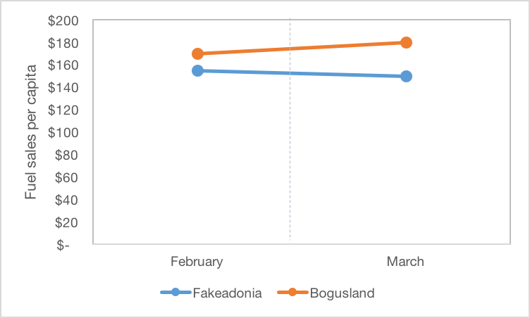

This section’s quiz will focus on a research project being designed by a hypothetical graduate student named Sophie. In the state where Sophie lives, the government has determined a need to take action on climate change. Like several other jurisdictions, her small island nation of Fakeadonia has decided to implement a carbon tax on fossil fuel use. More specifically, on March 1, 2013 the small island state introduced a carbon tax of $0.30 per litre. Sophie is interested in studying the impact of this new carbon tax on fuel sales in the country. Her study thus far has taken three different approaches. Answer the questions below referring to these approaches.

## Approach 1

Sophie’s first inclination is to compare February 2013 fuel sales to March 2013 fuel sales per capita to estimate the impact of the carbon tax. When she does this, she finds a decrease in sales between February and March from $155 per capita to $150. Plotting the data shows the following trend:

Please answer the following questions about Sophie’s study:

### Question 1

Which study design has she chosen to use?

* Post-only with control

* **Pre-post**

* Pre-post with control

* None of the above

*Explanation*
Sophie's study design includes 1 group, with one measurement before and after the intervention of interest. Thus, it is a pre-post study design.

### Question 2

Given the above study design, what will Sophie conclude about the carbon tax given her data?

* That it had no impact on fuel sales

* That it increased fuel sales by $5 per capita

* **That it decreased fuel sales by $5 per capita**

* None of the above

*Explanation*
In a pre-post study design, the counterfactual assumption is that the level of the outcome would not have changed absent the change being studied. As the outcome before the carbon tax was \$155, Sophie would assume that this level would have persisted into March. However, her observed outcome was \$150, a decrease of \$5 per capita.

### Question 3

Which of the following threats to internal validity might affect this result?

* **History** 

* **Maturation**

* **Instrumentation** 

* **Statistical Regression**

* Selection

*Explanation*
The only threat to validity in this list that does not potentially apply to this result is selection bias, which by definition requires that more than one group be compared. Each of the other is plausible given the weak study design she has chosen and would require significant investigation.

## Approach 2

As Sophie realizes that several of these threats to validity are plausible, her next inclination is to compare fuel sales per capita in Fakeadonia to those in the neighboring island of Notrealistan, which is very similar in size, socioeconomic status, and vehicle ownership. Unfortunately, she cannot find data for February from Notrealistan, so she can only compare March figures. Doing so, she finds that Fakedonia had fuel sales that were 30% lower than Notrealistan’s in that month.

 

### Question 4

What study design has Sophie now chosen to use?

* **Post-only with control**

* Pre-post

* Pre-post with control

* None of the above

*Explanation*
Sophie's study now compares two different areas at one time period after the intervention of interest. Thus, this is a post-only with control study.

### Question 5

Given this study design, what is Sophie’s counterfactual assumption?

* **That fuel sales in Fakeadonia would have been the same as Notrealistan absent the carbon tax** 

* That fuel sales in Fakeadonia would not have changed absent the carbon tax

* That fuel sales in Notrealistan did not decline between February and March

* None of the above

*Explanation*
In a post-only with control study, the assumption is that the counterfactual outcome in the intervention group would have mirrored that observed in the control group. Thus, in this case Sophie would have concluded that fuel sales per capita would have been $170 in March absent the carbon tax.

### Question 6

Which threat to validity is likely the most important for Sophie to consider with this research design?

* History

* Maturation

* Instrumentation

* Statistical regression

* **Selection** 

*Explanation*
This study design is very prone to selection bias. It is likely that the locations vary on a number of other factors -- both observable and unobservable -- that impact fuel sales.

## Approach 3

Finally, with a stroke of luck, Sophie manages to obtain data for both February and March of 2013 from another similar neighboring island, Bogusland. Examining the data points, she finds that while fuel sales decreased by \$5 per capita in Fakeadonia (from \$155 to \$150), they increased by \$10 in Bogusland (from \$170 to \$180). Her data now look like this:

### Question 7

Which study design has Sophie now chosen to use?

* Post-only with control

* Pre-post

* **Pre-post with control** 

* Interrupted time series

* None of the above

*Explanation*
Sophie now has data for two groups at one time period before the intervention and one time period after. This reflects a pre-post with control design.

### Question 8

Given this design, what is her counterfactual assumption about what fuel sales would have been in Fakeadonia absent the carbon tax?

* $150

* $155

* $160

* **$165** 

* $170

* $175

* $180

*Explanation*
The counterfactual assumption in this study design is that the outcome would have changed in the invention group in the same manner as the control group absent the intervention. Thus, as the outcome increased by \$10 in the control group, the counterfactual would be a \$10 increase in the intervention group. As the pre-intervention level was \$155 in Fakeadonia, this means the counterfactual would have been $165.

### Question 9

While investigating her topic, Sophie finds that Bogusland has a school vacation in March during which many families travel. Fakeadonia does not have a school break in March. Which threat to validity does this represent?

* History

* **Selection-history**

* Instrumentation

* **Selection-instrumentation**

* None of the above

*Explanation*
School break is clearly an event that occurs between the periods, so is a history threat to validity. However, in this case as it only affects one group and not the other, it is an interaction with selection in this instance.
