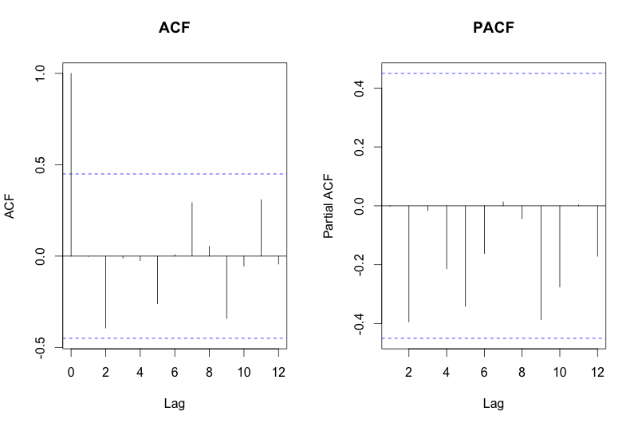

To continue this week's problem set, please use the West Virginia dataset and the steps outlined in this Unit to:

* Perform a Durbin Watson test up to 8 lag periods

* Produce ACF and PACF plots

* Assess the above plots for potential AR() and MA() processes

After you have completed these steps, please answer the questions below.


```r
# Load the necessary libraries
library(nlme)
library(car)
library(readr)

# Read in the dataset
dat <- read_csv("antipsychotic_study.csv")

# add time, level and trend variables
dat$time <- 1:nrow(dat)
dat$level <- c(rep(0,8),rep(1,11))
dat$trend <- c(rep(0,8), 1:11)

# A preliminary OLS regression
model_ols <- lm(marketshare ~ time + level + trend, data = dat)

# Durbin-watson test, 8 time periods
dwt(model_ols, max.lag = 8, alternative = "two.sided")
```

```
##  lag Autocorrelation D-W Statistic p-value
##    1    -0.001733220     1.6380570   0.090
##    2    -0.394108972     2.3765714   0.574
##    3    -0.011664947     1.3754568   0.290
##    4    -0.025092904     1.3730357   0.504
##    5    -0.261544418     1.8301083   0.532
##    6     0.007689319     1.2840645   0.930
##    7     0.293015206     0.6858671   0.164
##    8     0.053373059     0.9822333   0.754
##  Alternative hypothesis: rho[lag] != 0
```

```r
# Graph the residuals from the OLS regression to check for serially correlated errors
plot(dat$time,
     residuals(model_ols),
     type = 'o',
     pch = 16,
     xlab = 'Time',
     ylab = 'OLS Residuals',
     col = "red")
abline(h = 0,lty = 2)
```

<!-- -->

```r
# Plot ACF and PACF
par(mfrow = c(1,2))
acf(residuals(model_ols), main = "ACF")
acf(residuals(model_ols), type = 'partial', main = "PACF")
```

<!-- -->

## Question 1

On what lag values of the Durbin Watson test is the statistic significantly different from 2?

* 1

* 2

* 3

* 4

* 5

* 6

* 7

* 8

* **None of the above**

*Explanation*
The Durbin-Watson test does not indicate any values that are significantly different from 2 at the p < 0.05 level.

### Autocorrelation Plots
Please select which plot resembles the one you produced for the West Virginia data:




## Question 2

Which of the plots above resembles the ones you produced?

* Image 1

* **Image 2**

Based on these plots, what AR() and MA() parameters would you use in your final model?

**AR: 0**

**MA: 0**

*Explanation*
There are no indications of significiant spikes in either the ACF or PACF for this data, suggesting that no AR() or MA() process underlies the data.
