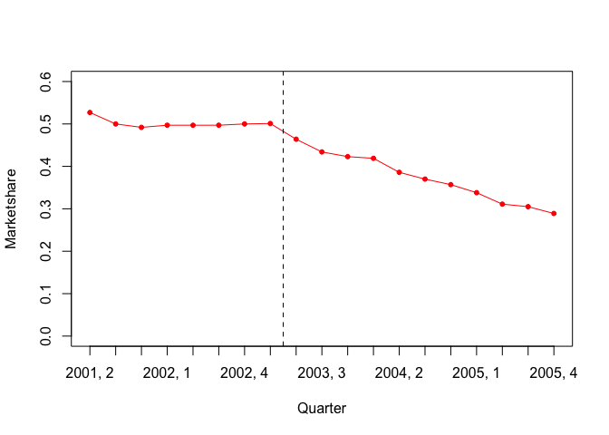
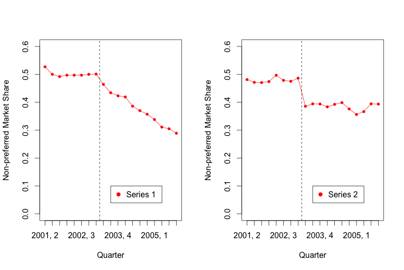

For this week's problem set, you will use the dataset from West Virginia Medicaid that you downloaded earlier. Please use the steps outlined in this unit to:

1. Add the additional necessary variables in Excel or another spreadsheet program (time, level, trend). For this step, remember that the prior authorization policy being studied started in Quarter 2 of 2003.

2. Import the data into R, either using the "import" button in RStudio or the read.csv() function.

3. Produce an initial plot of the data.


```r
# Load the necessary libraries
library(nlme)
library(car)
library(readr)

# Read in the dataset
dat <- read_csv("antipsychotic_study.csv")

# add time, level and trend variables
dat$time <- 1:nrow(dat)
dat$level <- c(rep(0,8),rep(1,11))
dat$trend <- c(rep(0,8), 1:11)

# Plot outcome variable versus time
plot(dat$time, dat$marketshare,
     ylab="Marketshare",
     ylim=c(0,0.6),
     xlab="Quarter",
     type="l",
     col="red",
     xaxt="n")

# Add x-axis year labels
axis(1, at=1:19, labels=dat$yearqtr)

# Add in the points for the figure
points(dat$time, dat$marketshare,
       col="red",
       pch=20)

# Label the intervention
abline(v=8.5,lty=2)
```

<!-- -->


## Question 1

What is the total number of time points in the dataset?


```r
nrow(dat)
```

```
## [1] 19
```

At what value of data$time did you draw the abline indicating the start of the prior authorization policy?

*8.5*


The following questions make reference to the two plots below:

 

## Question 3

Which plot looks most similar to the one you produced using the data?

* **Series 1**

* Series 2

## Question 4

Which of the plots is consistent with a change in level following the policy change?

**Series2**

*Explanation*
Remember that a level change is an immediate drop in the outcome that is sustained over the post period. As the drop in Series 2 is abrupt and continues the pre-existing flat trend, it is representative of a level change.
 
