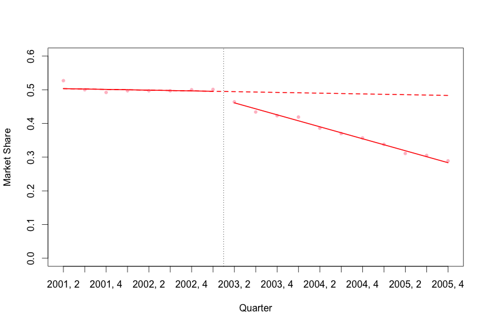

```{r setup, include=FALSE}
knitr::opts_chunk$set(echo = TRUE)
```

For our final exercise with the West Virginia data, please replicate the plot below in R.



```{r message=FALSE}
# Load the necessary libraries
library(nlme)
library(car)
library(readr)

# Read in the dataset
dat <- read_csv("antipsychotic_study.csv")

# add time, level and trend variables
dat$time <- 1:nrow(dat)
dat$level <- c(rep(0,8),rep(1,11))
dat$trend <- c(rep(0,8), 1:11)

# Fit the GLS regression model
model_final <- gls(marketshare ~ time + level + trend,
  data = dat,
  correlation = NULL,
  method = "ML")

# Final plot
plot(dat$time, dat$marketshare,
     ylim = c(0,0.6),
     ylab = "Market Share",
     xlab = "Quarter",
     pch = 20,
     col = "pink",
     xaxt = "n")

# Add x axis with dates
axis(1, at = 1:19, labels = dat$yearqtr)

# Add line indicating weather pattern change
abline(v = 8.5, lty = "dotted")

# Plot the first line segment
lines(dat$time[1:8], fitted(model_final)[1:8], col = "red", lwd = 2)
# Plot the second line segment
lines(dat$time[9:19], fitted(model_final)[9:19], col = "red", lwd = 2)

# And the counterfactual
segments(1,
         model_final$coef[1] + model_final$coef[2],
         19,
         model_final$coef[1] + model_final$coef[2]*19,
         lty = 2,
         lwd = 2,
         col = 'red')


```

## Question 1

What is the absolute predicted change in the market share for non-preferred agents in West Virginia at 6 quarters after the policy was introduced (as a proportion to 2 decimal places - e.g. 0.47)?

```{r}
# Predicted value at 6 quarters after the policy change
pred <- fitted(model_final)[14]

# Then estimate the counterfactual at the same time point
cfac <- model_final$coef[1] + model_final$coef[2]*14

# Absolute change at 6 quarters
round(pred - cfac, 2)
```

## Question 2

Now, what would the relative change be at 2 years after the policy change (as a percentage - e.g. 14.3)?

```{r}
# Predicted value at 8 quarters after the policy change
pred_8 <- fitted(model_final)[16]

# Then estimate the counterfactual at the same time point
cfac_8 <- model_final$coef[1] + model_final$coef[2]*16

# Relative change at 8 quarters as %
round((pred_8 - cfac_8) / cfac_8 * 100, 2)
```
